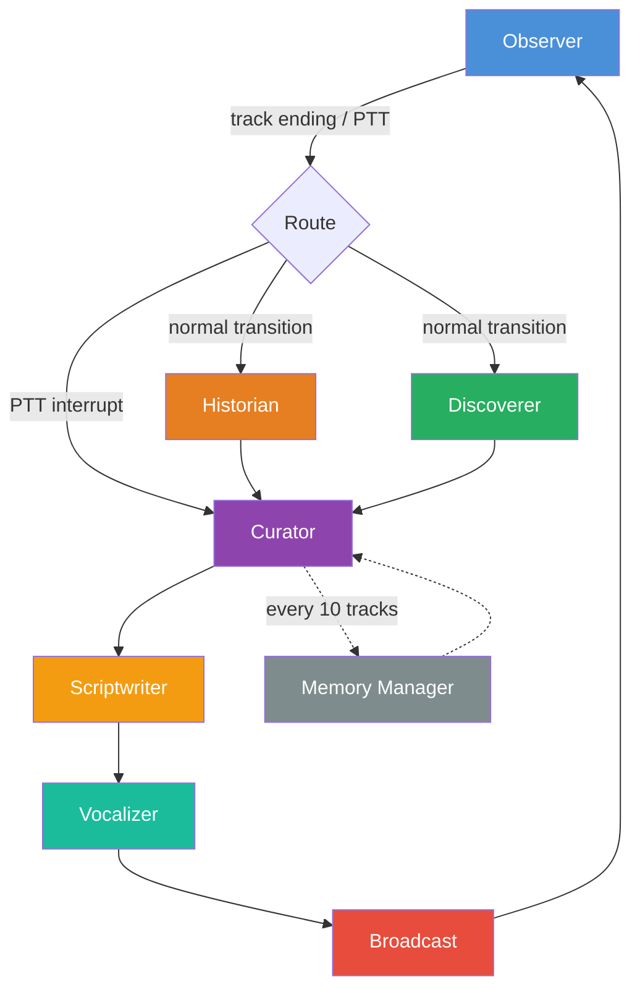

# 📻 EchoDJ — Product Specification (v2.0)

> An agentic, personalized AI radio station built on the Spotify ecosystem. EchoDJ replicates the lean-back experience of a traditional radio station by choosing songs based on the user's deep listening history and spoken context between tracks. Unlike static playlists, EchoDJ is **agentic**: it reasons over external knowledge graphs to find non-obvious links between songs, discovers new music through collaborative filtering, and responds to real-time voice commands.

---

## 1. Executive Summary & Constraints

### 1.1 Vision
EchoDJ is an intelligent companion application for a Master's in Data Science capstone. It demonstrates **Graph RAG** — a Knowledge Graph + Retrieval-Augmented Generation pipeline inspired by Diamantini et al. (2026, *Data Science and Engineering*) — where a persistent Music Knowledge Graph enriches LLM prompts for track ranking and explainable recommendations. The system also demonstrates **Multi-Agent Orchestration** (7 specialized LangGraph nodes collaborating in a stateful loop) and **Real-Time Audio Processing** (speech-to-text, text-to-speech, and audio ducking).

### 1.2 Hard Constraints

| Constraint | Detail |
|:-----------|:-------|
| **Spotify Premium** | Required. The Web Playback SDK only works with Premium accounts. This is a hard dependency documented in all user-facing materials. |
| **Deprecated Spotify APIs** | The following endpoints are **restricted for new apps** as of November 2024 and MUST NOT be used: `/v1/recommendations`, `/v1/audio-features`, `/v1/audio-analysis`, `/v1/artists/{id}/related-artists`. |
| **Frontend** | Next.js 15.x (App Router). Pin to latest stable 15.x release. |
| **LLM** | Plug-and-play via `LLMProvider` protocol. No model is locked in — swap via environment variable. |
| **Deployment** | Local-only for capstone demo (frontend + backend on the same machine). |
| **Target User** | Single user. No multi-tenancy required for v1. |
| **GPU** | Development on RTX 3090 (24GB VRAM). Faster-Whisper runs locally; LLM may run locally or via API depending on chosen model. |

---

## 2. Agent Architecture

### 2.1 The 7-Node LangGraph Loop



### 2.2 Node Roles (Summary)

| Node | Role | Data Sources |
|:-----|:-----|:-------------|
| **Observer** | Monitors playback state, captures PTT audio, detects track endings | Spotify SDK events, browser mic |
| **Historian** | Finds trivia links between consecutive artists via knowledge graph | Wikidata SPARQL, MusicBrainz REST |
| **Discoverer** | Finds tracks the user will enjoy via collaborative filtering | Last.fm, ListenBrainz, Spotify user profile |
| **Curator** | Merges candidate lists, applies rules, selects final track | Historian + Discoverer outputs, LangGraph Store |
| **Scriptwriter** | Generates a personality-driven spoken liner (15–20s) | Trivia link, track metadata |
| **Vocalizer** | Converts script to speech audio | edge-tts |
| **Broadcast** | Signals frontend to duck music, plays DJ audio | WebSocket to frontend |
| **Memory Manager** | Condenses session data into persistent Listener Profile | LangGraph Store |

### 2.3 Execution Modes

**Normal Transition** (track ending):
```
Observer → [Historian + Discoverer] (parallel) → Curator → Scriptwriter → Vocalizer → Broadcast → Observer
```

**PTT Interrupt** (user speaks mid-song):
```
Observer → Curator (re-route) → Scriptwriter (acknowledgment) → Vocalizer → Broadcast → Observer
```

**Pre-computation** (latency optimization):
The Observer triggers the Historian + Discoverer pipeline at **75% track progress**, not at track end. By the time the song finishes, the DJ break audio is already buffered and ready to play.

---

## 3. LangGraph State Contract

### 3.1 Core State Schema

```python
from typing import Annotated, Literal, TypedDict
from operator import add
from langgraph.graph import add_messages
from langchain_core.messages import BaseMessage

class DJState(TypedDict):
    # ── Observer Writes ──────────────────────────────────────
    current_track: SpotifyTrack | None          # Currently playing
    previous_tracks: Annotated[list[SpotifyTrack], add]  # Rolling history
    playback_progress: float                     # 0.0 – 1.0
    track_ending_soon: bool                      # True when progress > 0.75
    user_utterance: str | None                   # Whisper transcription
    user_intent: UserIntent | None               # Parsed intent
    skipped_tracks: Annotated[list[str], add]    # Skip tracking: negative signals
    skip_detected: bool                          # True if track changed < 30%
    
    # ── Historian Writes ─────────────────────────────────────
    trivia_link: TriviaLink | None
    trivia_confidence: float                     # 0.0 – 1.0
    trivia_context: list[TriviaLink]             # Graph RAG: ALL known links (Diamantini et al.)
    
    # ── Discoverer Writes ────────────────────────────────────
    taste_candidates: list[CandidateTrack]       # Ranked by taste match
    
    # ── Curator Writes ───────────────────────────────────────
    next_track: SpotifyTrack | None
    curator_reasoning: str
    active_segment_label: str | None
    queue_action: Literal["play_next", "interrupt", "continue"]
    
    # ── Scriptwriter Writes ──────────────────────────────────
    script_text: str
    script_word_count: int
    
    # ── Vocalizer Writes ─────────────────────────────────────
    audio_buffer: bytes | None
    audio_duration_ms: int
    
    # ── Broadcast Writes ─────────────────────────────────────
    ducking_active: bool
    
    # ── Session Context ──────────────────────────────────────
    session_id: str
    user_id: str
    discussed_trivia: list[str]                  # Prevents repetition
    session_vibe: str                            # "chill", "energetic", etc.
    tracks_since_last_memory_update: int
    messages: Annotated[list[BaseMessage], add_messages]
```

### 3.2 Supporting Data Models

```python
from dataclasses import dataclass, field
from enum import Enum

@dataclass
class SpotifyTrack:
    spotify_uri: str                  # "spotify:track:4iV5W9uYEdYUVa79Axb7Rh"
    track_name: str
    artist_name: str
    album_name: str
    album_art_url: str | None
    duration_ms: int
    genres: list[str] = field(default_factory=list)

@dataclass
class TriviaLink:
    link_type: str                    # "shared_producer", "same_studio", "genre_movement", "influence"
    entity_a: str                     # Artist/track name (previous)
    entity_b: str                     # Artist/track name (next)
    connecting_entity: str            # The shared element (producer name, studio, etc.)
    description: str                  # Human-readable: "Both produced by Brian Eno"
    confidence: float                 # 0.0 – 1.0
    wikidata_qids: list[str] = field(default_factory=list)

@dataclass
class CandidateTrack:
    spotify_uri: str
    track_name: str
    artist_name: str
    source: str                       # "lastfm", "listenbrainz", "historian", "spotify_top"
    relevance_score: float            # 0.0 – 1.0
    trivia_link: TriviaLink | None    # Only populated for Historian candidates
    kg_relationships: tuple[dict, ...] = ()   # Graph RAG: KG context (Diamantini et al.)
    kg_explanation: str = ""                   # LLM-generated relevance explanation

class UserIntent(Enum):
    CHANGE_VIBE = "change_vibe"       # "Play something more upbeat"
    SKIP = "skip"                     # "Skip this" / "Next"
    MORE_INFO = "more_info"           # "Tell me more about this artist"
    SPECIFIC_REQUEST = "specific"     # "Play some Miles Davis"
    POSITIVE_FEEDBACK = "positive"    # "I love this" / "This is great"
    NEGATIVE_FEEDBACK = "negative"    # "Not feeling this"
```

### 3.3 Node Read/Write Permissions

| Field | Observer | Historian | Discoverer | Curator | Scriptwriter | Vocalizer | Broadcast | Memory Mgr |
|:------|:---------|:----------|:-----------|:--------|:-------------|:----------|:----------|:-----------|
| `current_track` | W | R | R | R | R | | | R |
| `previous_tracks` | W | R | R | R | R | | | R |
| `playback_progress` | W | | | | | | | |
| `track_ending_soon` | W | | | | | | | |
| `user_utterance` | W | | | R | R | | | |
| `user_intent` | W | | | R | | | | |
| `trivia_link` | | W | | R | R | | | R |
| `trivia_confidence` | | W | | R | | | | |
| `taste_candidates` | | | W | R | | | | |
| `next_track` | | | | W | R | | | R |
| `curator_reasoning` | | | | W | | | | |
| `queue_action` | | | | W | | | R | |
| `script_text` | | | | | W | R | | |
| `script_word_count` | | | | | W | | | |
| `audio_buffer` | | | | | | W | R | |
| `audio_duration_ms` | | | | | | W | R | |
| `ducking_active` | | | | | | | W | |
| `discussed_trivia` | | | | | R/W | | | R |
| `session_vibe` | | | | R | R | | | W |
| `tracks_since_last_memory_update` | | | | W | | | | R/W |

---

## 4. Technical Stack

| Layer | Component | Technology | Notes |
|:------|:----------|:-----------|:------|
| **Frontend** | Framework | Next.js 15.x (App Router) | TypeScript, React 19 |
| **Frontend** | Playback | Spotify Web Playback SDK | Requires Premium |
| **Frontend** | Audio viz | Web Audio API `AnalyserNode` | DJ voice only |
| **Backend** | API server | FastAPI (Python 3.12+) | WebSocket + REST |
| **Backend** | Agent orchestration | LangGraph | Stateful multi-agent graph |
| **Backend** | Session persistence | LangGraph `SqliteSaver` | Thread-scoped checkpointing |
| **Backend** | Long-term memory | LangGraph `SqliteStore` | Cross-session user profile |
| **Intelligence** | LLM | Plug-and-play (`LLMProvider` protocol) | Gemini, Ollama, OpenAI — via env var |
| **Intelligence** | STT | Faster-Whisper (local) | RTX 3090, large-v3, int8 quantization |
| **Intelligence** | TTS | edge-tts | Microsoft Neural Voices, free |
| **Knowledge** | Graph RAG (KG) | Music Knowledge Graph (SQLite) + Wikidata SPARQL + MusicBrainz REST | Persistent artist relationships, local-first lookups, KG-enriched LLM ranking (Diamantini et al.) |
| **Knowledge** | Collaborative filtering | Last.fm API + ListenBrainz API | Taste-based discovery |
| **Comms** | Real-time | WebSocket (persistent) | Audio streaming + events |

### 4.1 LLM Provider Abstraction

```python
from typing import Protocol

class LLMProvider(Protocol):
    async def generate(self, system_prompt: str, user_prompt: str) -> str:
        """Generate a text response. All agents call this single interface."""
        ...

# Configure via environment:
# ECHODJ_LLM_PROVIDER=gemini|ollama|openai
# ECHODJ_LLM_MODEL=gemini-2.0-flash|gemma3:4b|gpt-4o-mini
```

---

## 5. Node Specifications

### 5.1 Observer Node

**Purpose:** Monitors Spotify playback state and captures user voice input.

**Inputs (reads):** None (event-driven entry point)

**Outputs (writes):** `current_track`, `previous_tracks`, `playback_progress`, `track_ending_soon`, `user_utterance`, `user_intent`

**Event Sources:**
1. **Spotify SDK `player_state_changed`** — fired on play, pause, track change, seek. The Observer extracts track metadata and updates `current_track`.
2. **WebSocket `playback_state` messages** — the frontend forwards SDK state at 1 Hz (for progress tracking without excessive JS-to-Python overhead).
3. **WebSocket `ptt_start` / `ptt_end` + binary audio frames** — PTT audio from the browser mic.

**Internal Play Log:**
- The Observer maintains `previous_tracks` as a rolling list (max 20).
- This is NOT sourced from Spotify's `recently-played` API (which has a 15-minute delay and 50-track limit). Instead, it's built from observed `player_state_changed` events.

**Pre-computation Trigger:**
- When `playback_progress > 0.75`, set `track_ending_soon = True`.
- This signal triggers the Historian + Discoverer to begin their work *before* the track ends.

**PTT Pipeline:**
1. Frontend sends `ptt_start` → Observer begins buffering binary audio frames
2. Frontend sends `ptt_end` → Observer concatenates frames into a single audio buffer
3. Buffer → Faster-Whisper (local, int8, beam_size=2) → `user_utterance`
4. Utterance → LLM intent classifier → `user_intent` (see §5.4.1)

**Latency Target:** PTT transcription < 1s on RTX 3090.

**Error Handling:**
- Whisper transcription fails → write `user_utterance = None`, do not route to Curator
- Spotify SDK disconnects → send `reconnect_required` via WebSocket to frontend

---

### 5.2 Historian Agent (Graph RAG)

**Purpose:** Queries the Music Knowledge Graph (local-first) and Wikidata SPARQL to find trivia links between consecutive artists. Implements a Graph RAG pipeline per Diamantini et al. (2026).

**Graph RAG Architecture (Paper §3–§4):**

The Historian operates on a two-layer Knowledge Graph:
- **Background Layer** (stable): Artist entities, MBIDs, genres, and inter-artist relationships (shared producers, studios, genre movements). Persisted across sessions in SQLite.
- **Source Profile Layer** (dynamic): Session play counts, user feedback signals. Updated per track.

**Inputs (reads):** `current_track`, `previous_tracks`, `discussed_trivia`

**Outputs (writes):** `trivia_link`, `trivia_confidence`, `trivia_context` (list of ALL known links — Graph RAG)

**Query Strategy (local-first + SPARQL fallback):**

1. **Local KG Lookup:** Check the Music Knowledge Graph for cached relationships between the two artists. If a strong hit (≥ 0.6 confidence) exists, skip SPARQL entirely.
2. **MBID Resolution:** Check KG cache for MusicBrainz IDs, then resolve via MusicBrainz API for uncached artists. Store resolved MBIDs back to KG.
3. **SPARQL Queries:** If no strong local hit, run up to 3 SPARQL queries in sequence (shared producer → same studio → shared genre), stopping at first hit ≥ 0.6.
4. **KG Accumulation:** Store ALL SPARQL results back to the local KG. Over time, lookups become entirely local-first.
5. **Context Export:** Return `trivia_context` — ALL known relationships (not just the best) — for the Curator's KG-enriched LLM ranking.

**Query 1: Shared Producer (`P162`)**
```sparql
SELECT ?producerLabel WHERE {
  ?artist_a wdt:P434 "{mbid_a}" .       # MusicBrainz ID → Wikidata entity
  ?artist_b wdt:P434 "{mbid_b}" .
  ?artist_a wdt:P162 ?producer .
  ?artist_b wdt:P162 ?producer .
  SERVICE wikibase:label { bd:serviceParam wikibase:language "en". }
}
LIMIT 5
```

**Query 2: Same Recording Studio (`P1762`)**
```sparql
SELECT ?studioLabel WHERE {
  ?artist_a wdt:P434 "{mbid_a}" .
  ?artist_b wdt:P434 "{mbid_b}" .
  ?artist_a wdt:P1762 ?studio .
  ?artist_b wdt:P1762 ?studio .
  SERVICE wikibase:label { bd:serviceParam wikibase:language "en". }
}
LIMIT 5
```

**Query 3: Shared Genre Movement (`P136`)**
```sparql
SELECT ?genreLabel WHERE {
  ?artist_a wdt:P434 "{mbid_a}" .
  ?artist_b wdt:P434 "{mbid_b}" .
  ?artist_a wdt:P136 ?genre .
  ?artist_b wdt:P136 ?genre .
  SERVICE wikibase:label { bd:serviceParam wikibase:language "en". }
}
LIMIT 5
```

**Artist Name → MusicBrainz ID Resolution:**
- `GET https://musicbrainz.org/ws/2/artist/?query=artist:{name}&fmt=json&limit=1`
- Cache resolved MBIDs **in the Music Knowledge Graph** (persists across sessions).
- User-Agent header required: `EchoDJ/1.0 (your-email@example.com)`

**MusicBrainz ID → Wikidata QID:**
- Wikidata property `P434` stores MusicBrainz Artist IDs.
- SPARQL filter: `?entity wdt:P434 "{mbid}"` resolves to the Wikidata entity.

**Rate Limits:**
- Wikidata SPARQL: 5 requests/second (respect `Retry-After` headers)
- MusicBrainz REST: 1 request/second (requires User-Agent)

**Timeout:** 2 seconds hard cap per SPARQL query. If all 3 queries timeout or return empty, `trivia_link = None`, `trivia_confidence = 0.0`.

**Repetition Guard:** Before returning a trivia link, check against `discussed_trivia`. If the link has been used before, downgrade confidence to 0.0.

**Fallback Cascade:**
1. Local KG has a strong link (confidence ≥ 0.6) → use it (skip SPARQL)
2. SPARQL returns a strong link (confidence ≥ 0.6) → use it, store to KG
3. SPARQL times out or no link → check if artists share genres from Spotify metadata → generate a genre-based link (confidence 0.4), store to KG
4. No meaningful link found → `trivia_link = None`, Scriptwriter will use a simple introduction template

**Latency Target:** < 2s total (including KG lookup + MBID resolution + SPARQL).

---

### 5.3 Discoverer Agent (Taste Profile)

**Purpose:** Finds tracks the user will enjoy based on collaborative filtering from Last.fm and ListenBrainz.

**Inputs (reads):** `current_track`, `previous_tracks`

**Outputs (writes):** `taste_candidates` (list of `CandidateTrack`, max 20)

**Data Source 1: Last.fm**

```
GET https://ws.audioscrobbler.com/2.0/
    ?method=artist.getSimilar
    &artist={current_track.artist_name}
    &api_key={LASTFM_API_KEY}
    &format=json
    &limit=10

GET https://ws.audioscrobbler.com/2.0/
    ?method=track.getSimilar
    &artist={current_track.artist_name}
    &track={current_track.track_name}
    &api_key={LASTFM_API_KEY}
    &format=json
    &limit=10
```

- Combine results from both endpoints.
- For each similar artist, pick their top track via `artist.getTopTracks` (limit 1).
- De-duplicate by artist.

**Data Source 2: ListenBrainz**

```
GET https://api.listenbrainz.org/1/cf/recommendation/user/{lb_username}/recording
    Authorization: Token {LB_USER_TOKEN}
```

- Returns collaborative filtering recommendations based on the user's listening history.
- Requires the user to have a ListenBrainz account with linked Spotify scrobbling.
- If the user doesn't have a ListenBrainz account, this source is skipped gracefully.

**Data Source 3: Spotify User Profile (seed/fallback)**

```
GET https://api.spotify.com/v1/me/top/tracks?time_range=medium_term&limit=20
GET https://api.spotify.com/v1/me/top/artists?time_range=medium_term&limit=10
```

- Used to seed the Discoverer when Last.fm/ListenBrainz data is sparse.
- Used as the **primary fallback** if both Last.fm and ListenBrainz fail.

**Track Resolution:**
- Last.fm and ListenBrainz return track/artist names, not Spotify URIs.
- Resolve to Spotify URIs via `GET /v1/search?q=track:{name}+artist:{artist}&type=track&limit=1`.
- Cache resolved URIs for the session.

**Output:** A ranked list of up to 20 `CandidateTrack` objects, each with:
- `spotify_uri` (resolved)
- `source` ("lastfm", "listenbrainz", "spotify_top")
- `relevance_score` (normalized 0–1 based on source ranking)

**Latency Target:** < 2s total (parallel API calls + Spotify search resolution).

**Error Handling:**
- Last.fm API fails → skip, continue with ListenBrainz + Spotify
- ListenBrainz API fails → skip, continue with Last.fm + Spotify
- Both fail → return Spotify top tracks shuffled as candidates
- Spotify search fails for a candidate → drop that candidate

---

### 5.4 Curator Agent (Orchestrator)

**Purpose:** Merges candidates from the Historian and Discoverer, applies session rules, selects the final track, and queues it on Spotify.

**Inputs (reads):** `taste_candidates`, `trivia_link`, `trivia_confidence`, `previous_tracks`, `session_vibe`, `user_utterance`, `user_intent`, Listener Profile (from LangGraph Store)

**Outputs (writes):** `next_track`, `curator_reasoning`, `queue_action`, `tracks_since_last_memory_update`

**Selection Algorithm:**

1. **Merge candidate lists:**
   - Historian candidates (from `trivia_link` — if the Historian found a linked artist, that artist's top tracks are candidates with `source = "historian"`)
   - Discoverer candidates (from `taste_candidates`)

2. **Score each candidate (Graph RAG — LLM-driven ranking with KG context):**

   The Curator uses an LLM-driven ranking approach enriched with Knowledge Graph context (per Diamantini et al., Table 3: KG context improves ranking accuracy by 18.2%):

   The LLM receives:
   - Listener profile (genre affinities, favorite artists, discovery openness)
   - Session context (vibe, previous 5 tracks)
   - **Knowledge Graph context**: all known relationships from `trivia_context`, plus per-candidate KG enrichment from the Music Knowledge Graph
   - Candidate list with source and relevance scores

   The LLM outputs a JSON selection with structured reasoning:
   ```json
   {"selection_index": 0, "reasoning": "Selected because both artists worked with producer Brian Eno"}
   ```

   **Fallback:** If LLM ranking times out (3s) or fails to parse, the Curator falls back to static weighted scoring:
   ```
   score = (w_trivia × trivia_bonus) + (w_taste × relevance_score) + (w_profile × profile_match)
   ```
   Where:
   - `trivia_bonus` = `trivia_confidence` for Historian candidates, 0.0 for others
   - `relevance_score` = from the Discoverer's ranking
   - `profile_match` = genre overlap with `ListenerProfile.genre_affinity`
   - Default weights: `w_trivia=0.4, w_taste=0.4, w_profile=0.2`

3. **Apply session rules:**
   - REJECT if artist appeared in `previous_tracks[-5:]` (no repeat artist within 5 tracks)
   - BOOST if genre matches `session_vibe`
   - Use LLM reasoning for ambiguous cases (e.g., user said "something more upbeat" — LLM evaluates which candidate best matches)

4. **Select the winner:** Highest-scoring candidate after rules.

5. **Queue on Spotify:**
   ```
   POST https://api.spotify.com/v1/me/player/queue?uri={next_track.spotify_uri}
   Authorization: Bearer {access_token}
   ```

**PTT Interrupt Mode:**
When `user_intent` is set (PTT was used), the Curator bypasses normal scoring:
- `SKIP` → select top Discoverer candidate immediately
- `CHANGE_VIBE` → update `session_vibe`, re-score with new vibe weights
- `SPECIFIC_REQUEST` → search Spotify for the requested entity, queue it directly
- `POSITIVE_FEEDBACK` → no track change, log feedback for Memory Manager
- `NEGATIVE_FEEDBACK` → skip current, boost diversity in next selection

**Memory Manager Trigger:**
Increment `tracks_since_last_memory_update`. If `≥ 10`, set a flag to run the Memory Manager node after Broadcast.

**Latency Target:** < 1.5s (including Spotify queue API call).

**Error Handling:**
- Spotify queue fails → retry once, then skip and log error
- No candidates available → play a random track from user's top tracks
- LLM reasoning times out → use pure score-based selection (no LLM)

#### 5.4.1 Intent Classifier Prompt

```
You are an intent classifier for a music DJ application. Given a user's spoken
command, classify it into exactly one of these categories:

- CHANGE_VIBE: User wants different energy/mood (e.g., "more upbeat", "something chill")
- SKIP: User wants to skip the current track (e.g., "next", "skip this")
- MORE_INFO: User wants more information about current track/artist
- SPECIFIC_REQUEST: User requests a specific artist/track/genre (e.g., "play some jazz")
- POSITIVE_FEEDBACK: User expresses they like the current selection
- NEGATIVE_FEEDBACK: User expresses dislike

Respond with ONLY the category name, nothing else.

User said: "{user_utterance}"
```

---

### 5.5 Scriptwriter Agent

**Purpose:** Generates a personality-driven spoken liner that bridges the previous and next track.

**Inputs (reads):** `trivia_link`, `current_track`, `next_track`, `discussed_trivia`, `user_utterance`, `session_vibe`

**Outputs (writes):** `script_text`, `script_word_count`

**System Prompt:**
```
You are the voice of EchoDJ — a late-night radio DJ with deep music knowledge
and a warm, conversational style. Think: a knowledgeable Zane Lowe meets the
intimacy of a college radio host at 2am.

RULES:
1. Never cite raw data. No "120 BPM", no "released in 1994", no Wikipedia-style facts.
2. Speak in second person ("you're going to love this", "this next one").
3. Bridge between the PREVIOUS track and the NEXT track using the trivia link.
4. Keep liners between 40–55 words (15–20 seconds when read aloud).
5. Never repeat trivia from previous breaks (check discussed_trivia).
6. If no trivia is available, introduce the next song with genuine enthusiasm.
7. If responding to a user command, acknowledge it naturally first.
8. Match the session vibe in your tone (chill = mellow, energetic = excited).
```

**User Prompt Template:**
```
Previous track: "{current_track.track_name}" by {current_track.artist_name}
Next track: "{next_track.track_name}" by {next_track.artist_name}
Trivia link: {trivia_link.description if trivia_link else "None available"}
Session vibe: {session_vibe}
User command: {user_utterance if user_utterance else "None"}
Already discussed: {discussed_trivia}

Write your DJ liner.
```

**Few-Shot Examples:**

*With trivia:*
> That was Radiohead drifting through the static. Now here's something — Portishead and Radiohead both found their way to the same Bristol studios in the mid-90s. Different sounds, same walls. Let that one sit with you — here's "Wandering Star."

*Without trivia:*
> Beautiful. Let's keep that feeling going — I've got Khruangbin lined up next and trust me, this one's going to hit just right. Sit back for "Time (You and I)."

*On PTT interrupt:*
> You got it — let's pick up the pace. Here's something with a little more drive. The Avalanches, coming in hot with "Frontier Psychiatrist."

**Guardrails:**
- If `script_word_count > 60`: truncate to first 55 words, append "..." — do NOT re-prompt (latency budget constraint)
- If LLM returns empty or nonsensical text: use fallback template:
  ```
  "Here's {next_track.track_name} by {next_track.artist_name}."
  ```
- After generating, append `trivia_link.description` to `discussed_trivia` to prevent repetition

**Latency Target:** < 1s.

---

### 5.6 Vocalizer Node

**Purpose:** Converts the Scriptwriter's text into spoken audio.

**Inputs (reads):** `script_text`

**Outputs (writes):** `audio_buffer`, `audio_duration_ms`

**Implementation:**
```python
import edge_tts
import io

async def vocalize(script_text: str) -> tuple[bytes, int]:
    communicate = edge_tts.Communicate(script_text, voice="en-US-GuyNeural")
    audio_data = io.BytesIO()
    async for chunk in communicate.stream():
        if chunk["type"] == "audio":
            audio_data.write(chunk["data"])
    
    audio_bytes = audio_data.getvalue()
    # Duration estimation: edge-tts outputs MP3 at ~32kbps for speech
    duration_ms = len(audio_bytes) * 8 // 32  # rough estimate
    return audio_bytes, duration_ms
```

**Voice Selection:** `en-US-GuyNeural` (warm, male, natural-sounding). Alternative: `en-US-AriaNeural` (female equivalent). Configurable via env var `ECHODJ_TTS_VOICE`.

**Latency Target:** < 1.5s for 15–20s of audio.

**Error Handling:**
- edge-tts service unavailable → `audio_buffer = None`, Broadcast node skips the DJ break entirely
- Audio generation exceeds 3s → timeout, skip DJ break

---

### 5.7 Broadcast Node

**Purpose:** Signals the frontend to duck Spotify volume, streams DJ audio, then restores volume.

**Inputs (reads):** `audio_buffer`, `audio_duration_ms`, `queue_action`

**Outputs (writes):** `ducking_active`

**Sequence:**
1. Send WebSocket message: `{ "type": "duck_start", "fade_ms": 300 }`
2. Wait 300ms for fade to complete
3. Stream `audio_buffer` via WebSocket binary frame
4. Wait for `audio_duration_ms`
5. Send WebSocket message: `{ "type": "duck_end", "fade_ms": 500 }`
6. If `queue_action == "play_next"`: send `{ "type": "skip_to_next" }` to trigger Spotify to advance to the queued track

**Latency Target:** Ducking must begin within 100ms of message receipt on the frontend.

**Error Handling:**
- WebSocket disconnected → skip DJ break, queue the track silently
- Frontend doesn't acknowledge `duck_start` within 1s → proceed anyway (best-effort ducking)

---

### 5.8 Memory Manager Node

**Purpose:** Periodically condenses session data into a persistent Listener Profile stored in LangGraph's `SqliteStore`.

**Trigger:** Runs when `tracks_since_last_memory_update >= 10` or at session end (WebSocket close event).

**Inputs (reads):** `previous_tracks`, `session_vibe`, `discussed_trivia`, `user_id` + Listener Profile from Store

**Outputs (writes):** Updated Listener Profile to Store, `tracks_since_last_memory_update` reset to 0

**Listener Profile Schema:**
```json
{
  "user_id": "eric",
  "updated_at": "2026-04-12T21:00:00Z",
  "genre_affinity": {
    "jazz": 0.85,
    "funk": 0.72,
    "indie_rock": 0.65,
    "country": 0.15
  },
  "artist_favorites": ["Miles Davis", "Herbie Hancock", "Khruangbin"],
  "artist_dislikes": [],
  "vibe_preference": "chill-to-moderate",
  "discovery_openness": 0.7,
  "avg_session_length_tracks": 15,
  "total_sessions": 12,
  "recent_mood_trajectory": "shifting from jazz toward funk/soul",
  "skip_patterns": "skips tracks over 7 minutes, dislikes country",
  "trivia_discussed": ["brian_eno_producer", "hansa_studios_berlin"]
}
```

**Memory Manager Prompt:**
```
You are a memory manager for a music DJ application. Given the user's existing
listener profile and their latest session data, output an UPDATED JSON profile.

Rules:
1. Adjust genre_affinity scores: increase for genres played, decrease for skipped.
2. Add artists to favorites if the user gave positive feedback or listened fully.
3. Update recent_mood_trajectory based on session vibe evolution.
4. Note any new skip patterns observed.
5. Increment total_sessions.
6. Merge new trivia into trivia_discussed.
7. Keep discovery_openness between 0.0 (only familiar) and 1.0 (very adventurous).
8. Output ONLY valid JSON, no explanation.
```

**Store Operations:**
```python
# Read
profile = store.get(("users", user_id, "listener_profile"), "profile")

# Write
store.put(("users", user_id, "listener_profile"), "profile", updated_profile)

# Append session summary
store.put(("users", user_id, "session_summaries"), session_id, session_summary)
```

**Cold Start:** When no profile exists in the Store:
1. Fetch user's top tracks and artists from Spotify (`/v1/me/top/tracks`, `/v1/me/top/artists`)
2. Extract genre distribution from top artists
3. Create an initial profile with genre affinities derived from this data
4. Set `discovery_openness = 0.5` (moderate default)

**Latency Target:** < 2s (LLM call + Store write). Not on the critical playback path — runs asynchronously while the next song plays.

---

## 6. Data Sources & API Strategy

| Source | Agent | Endpoint | Auth | Rate Limit | Timeout | Fallback |
|:-------|:------|:---------|:-----|:-----------|:--------|:---------|
| **Spotify Web API** | Observer, Curator, Discoverer | Various (see per-node) | OAuth 2.0 PKCE | Standard | 3s | Session pause + reconnect UI |
| **Spotify Web Playback SDK** | Observer (via frontend) | JS SDK events | OAuth token | N/A | N/A | Reconnect player |
| **Last.fm** | Discoverer | `artist.getSimilar`, `track.getSimilar` | API key | ~5 req/s | 3s | Skip, use other sources |
| **ListenBrainz** | Discoverer | `/1/cf/recommendation/user/{user}/recording` | User token | Rate-limited (check headers) | 3s | Skip, use other sources |
| **Wikidata** | Historian | SPARQL endpoint (`query.wikidata.org`) | None | 5 req/s (bots) | 2s | Genre-based fallback trivia |
| **MusicBrainz** | Historian | `/ws/2/artist/` | User-Agent header | 1 req/s | 2s | Skip MBID resolution, try name-based SPARQL |
| **edge-tts** | Vocalizer | Microsoft Edge TTS service | None | Reasonable | 3s | Skip DJ break |

### 6.1 Required API Keys & Accounts

| Key | Source | Required? |
|:----|:-------|:----------|
| `SPOTIFY_CLIENT_ID` | Spotify Developer Dashboard | Yes |
| `SPOTIFY_CLIENT_SECRET` | Spotify Developer Dashboard | Yes (server-side token refresh) |
| `LASTFM_API_KEY` | last.fm/api/account/create | Yes |
| `LISTENBRAINZ_USER_TOKEN` | listenbrainz.org/settings | Optional (enhances recommendations) |
| `ECHODJ_LLM_PROVIDER` | N/A (config) | Yes |
| `GEMINI_API_KEY` / `OPENAI_API_KEY` | Provider dashboard | If using API-based LLM |

---

## 7. Frontend ↔ Backend Protocol

### 7.1 Transport
- **Primary:** WebSocket (persistent, bidirectional) — `ws://localhost:8000/ws`
- **Secondary:** REST API for non-real-time operations (health check, config)

### 7.2 Connection Lifecycle
1. Frontend opens WebSocket with `Authorization: Bearer {spotify_access_token}` as a query param
2. Server validates token, responds with `{ "type": "connected", "session_id": "..." }`
3. Heartbeat: client sends `{ "type": "ping" }` every 30s, server responds `{ "type": "pong" }`
4. On disconnect: client attempts reconnect with exponential backoff (1s, 2s, 4s, max 30s)

### 7.3 Message Types

**Client → Server:**
```typescript
// Playback state update (1 Hz)
{ type: "playback_state", data: { 
    track_uri: string, position_ms: number, duration_ms: number, 
    is_playing: boolean, track_name: string, artist_name: string,
    album_art_url: string 
}}

// PTT lifecycle
{ type: "ptt_start" }
// ... binary frames (PCM 16kHz 16-bit mono, ~1s chunks) ...
{ type: "ptt_end" }

// User actions
{ type: "skip" }
{ type: "feedback", sentiment: "positive" | "negative" }
```

**Server → Client:**
```typescript
// Connection
{ type: "connected", session_id: string }
{ type: "pong" }

// Audio ducking
{ type: "duck_start", fade_ms: number }
{ type: "duck_end", fade_ms: number }

// DJ audio (binary frame — MP3 data)
// Sent as a WebSocket binary message immediately after duck_start

// Playback control
{ type: "skip_to_next" }
{ type: "now_playing", data: SpotifyTrack }

// Status updates (for HUD)
{ type: "status", node: string, message: string }
// Examples:
// { type: "status", node: "historian", message: "Searching Wikidata..." }
// { type: "status", node: "discoverer", message: "Finding similar tracks..." }
// { type: "status", node: "scriptwriter", message: "Writing liner..." }

// Trivia display
{ type: "trivia", data: { link_type: string, description: string } }

// Errors
{ type: "error", message: string, recoverable: boolean }
```

---

## 8. Audio Architecture

### 8.1 Audio Routing

```
┌──────────────────────────────────────────────────────────┐
│ Browser                                                   │
│                                                           │
│  ┌─────────────────────┐    ┌──────────────────────────┐ │
│  │ Spotify Web Playback │    │ HTML5 <audio> element    │ │
│  │ SDK                  │    │ (DJ voice)               │ │
│  │                      │    │                          │ │
│  │ Volume: controlled   │    │ Volume: always 100%      │ │
│  │ via player.setVolume │    │ Source: WebSocket binary  │ │
│  │ ()                   │    │ frames → Blob URL        │ │
│  └─────────────────────┘    └──────────────────────────┘ │
│                                        │                  │
│                              ┌─────────▼────────────┐    │
│                              │ Web Audio API         │    │
│                              │ AnalyserNode          │    │
│                              │ (frequency data for   │    │
│                              │  visualizer only)     │    │
│                              └──────────────────────┘    │
└──────────────────────────────────────────────────────────┘
```

### 8.2 Ducking Implementation

**Duck (fade down):**
```javascript
function duckSpotify(player, fadeMs = 300) {
    const startVolume = 1.0;
    const targetVolume = 0.2;
    const startTime = performance.now();
    
    function step(currentTime) {
        const elapsed = currentTime - startTime;
        const progress = Math.min(elapsed / fadeMs, 1.0);
        const volume = startVolume + (targetVolume - startVolume) * progress;
        player.setVolume(volume);
        if (progress < 1.0) requestAnimationFrame(step);
    }
    requestAnimationFrame(step);
}
```

**Restore (fade up):**
```javascript
function restoreSpotify(player, fadeMs = 500) {
    const startVolume = 0.2;
    const targetVolume = 1.0;
    const startTime = performance.now();
    
    function step(currentTime) {
        const elapsed = currentTime - startTime;
        const progress = Math.min(elapsed / fadeMs, 1.0);
        const volume = startVolume + (targetVolume - startVolume) * progress;
        player.setVolume(volume);
        if (progress < 1.0) requestAnimationFrame(step);
    }
    requestAnimationFrame(step);
}
```

**Timing Precision Target:** ±100ms.

### 8.3 DJ Audio Playback

```javascript
// On receiving binary WebSocket message (DJ audio)
socket.onmessage = (event) => {
    if (event.data instanceof Blob) {
        const audioUrl = URL.createObjectURL(event.data);
        const djAudio = document.getElementById('dj-audio');
        djAudio.src = audioUrl;
        djAudio.play();
        djAudio.onended = () => {
            URL.revokeObjectURL(audioUrl);
            // Send duck_end handled by server timing
        };
    }
};
```

---

## 9. Push-to-Talk Specification

### 9.1 Interaction Model
- **Type:** Hold-to-talk (audio captured while button is held)
- **Max recording duration:** 10 seconds (hard cap, auto-release)
- **Minimum duration:** 500ms (shorter = ignored, prevents accidental taps)
- **Debounce:** 500ms cooldown between releases (prevents spam)

### 9.2 Audio Capture
- **Format:** PCM, 16kHz sample rate, 16-bit depth, mono
- **Chunking:** Stream in ~1-second chunks via WebSocket binary frames
- **Total payload:** Max ~320KB for 10 seconds of audio

### 9.3 Visual States

| State | Appearance | Duration |
|:------|:-----------|:---------|
| **Idle** | Mic icon, subtle glow | Default |
| **Recording** | Pulsing red ring, waveform animation | While held |
| **Processing** | Spinner overlay, "Listening..." text | Whisper processing |
| **Responding** | Check icon, brief green flash | Agent acknowledgment |

### 9.4 Error States
- Microphone permission denied → show persistent "Mic access required" banner
- Recording too short (< 500ms) → ignore, stay in Idle
- Whisper fails → show "Didn't catch that" toast (3s), return to Idle

---

## 10. Memory System

### 10.1 Architecture

| Layer | Technology | Scope | Contains |
|:------|:-----------|:------|:---------|
| **Working Memory** | LangGraph `DJState` | Current graph execution | Current track, candidates, script, audio buffer |
| **Session Memory** | LangGraph `SqliteSaver` | Single session (thread) | Full message history, all state snapshots (enables resume) |
| **Long-Term Memory** | LangGraph `SqliteStore` | Cross-session (user) | Listener Profile, session summaries, trivia log |

### 10.2 Store Namespace Schema

```
("users", "{user_id}", "listener_profile")  →  { "profile": ListenerProfile }
("users", "{user_id}", "session_summaries")  →  { "{session_id}": SessionSummary }
("users", "{user_id}", "trivia_discussed")   →  { "all": list[str] }
```

### 10.3 Graph Compilation

```python
from langgraph.checkpoint.sqlite import SqliteSaver
from langgraph.store.sqlite import SqliteStore

checkpointer = SqliteSaver.from_conn_string("echodj_sessions.db")
store = SqliteStore.from_conn_string("echodj_memory.db")

app = graph.compile(checkpointer=checkpointer, store=store)
```

### 10.4 Cold Start Sequence

1. User authenticates with Spotify
2. Memory Manager checks Store for existing profile → none found
3. Fetch `GET /v1/me/top/tracks?time_range=medium_term&limit=50`
4. Fetch `GET /v1/me/top/artists?time_range=medium_term&limit=20`
5. Extract genre distribution from artist data
6. Create initial `ListenerProfile` with derived genre affinities
7. Store → user is ready to go

---

## 11. Spotify Authentication & Token Lifecycle

### 11.1 Flow
- **Type:** OAuth 2.0 Authorization Code Flow with PKCE
- **Why PKCE:** Client-side Next.js app cannot safely store a client secret

### 11.2 Required Scopes

| Scope | Used By |
|:------|:--------|
| `streaming` | Web Playback SDK |
| `user-modify-playback-state` | Queue tracks, skip, volume |
| `user-read-playback-state` | Read current track state |
| `user-read-currently-playing` | Observer node |
| `user-top-read` | Discoverer (top tracks/artists), cold start |
| `user-read-recently-played` | Fallback history source |

### 11.3 Token Management
- Access tokens expire after **60 minutes**
- A Next.js API route (`/api/auth/refresh`) handles silent token refresh server-side
- Refresh is triggered proactively at the **50-minute mark** (10-minute buffer)
- The refreshed token is pushed to the backend via WebSocket: `{ "type": "token_refresh", "access_token": "..." }`

### 11.4 Error Recovery
- Token expired unexpectedly → backend sends `{ "type": "error", "message": "auth_expired", "recoverable": true }`
- Frontend shows "Reconnecting to Spotify..." modal, attempts silent refresh
- If refresh fails (e.g., user revoked access) → redirect to login page

---

## 12. Error States & Degraded Modes

| Failure | Detection | Behavior | User Sees |
|:--------|:----------|:---------|:----------|
| Spotify token expired | 401 from API | Auto-refresh; if fails, pause + reconnect UI | "Reconnecting to Spotify..." modal |
| Spotify SDK disconnects | `player_state_changed` stops | Reconnect SDK, re-transfer playback | Brief pause, auto-recovery |
| Wikidata SPARQL timeout | 2s timeout | Fall back to genre-based trivia | DJ uses simple intro instead of trivia |
| MusicBrainz rate limited | 429 response | Queue + retry with backoff; use cached MBIDs | Slight delay in trivia |
| Last.fm API unavailable | Connection error | Discoverer uses ListenBrainz + Spotify only | No visible impact |
| ListenBrainz API unavailable | Connection error | Discoverer uses Last.fm + Spotify only | No visible impact |
| edge-tts unavailable | Connection error | Skip DJ break, play next track silently | Music continues without DJ voice |
| Faster-Whisper fails | Transcription returns empty | Show "Didn't catch that" toast | Toast notification |
| LLM returns >60 words | Word count check | Truncate to 55 words | Slightly shorter DJ break |
| LLM returns unsafe/empty | Content validation | Use fallback template intro | Generic but safe intro |
| SqliteStore corrupted | Read exception | Create fresh profile from Spotify top tracks | No visible impact (cold start) |
| User PTT during DJ break | State check | Queue the request, process after DJ audio finishes | Brief wait, then response |
| WebSocket drops | Close event | Exponential backoff reconnect (1s, 2s, 4s, max 30s) | "Reconnecting..." banner |
| Multiple PTT spam | Debounce check | Ignore presses within 500ms cooldown | No response until cooldown |

---

## 13. UI/UX Specification

### 13.1 Layout

```
┌─────────────────────────────────────────────────────────┐
│                    STATUS HUD                            │
│         "Historian searching Wikidata..."                │
├─────────────────────────────────────────────────────────┤
│                                                          │
│              ┌─────────────────────┐                     │
│              │                     │                     │
│              │    ALBUM ART        │                     │
│              │    (large)          │                     │
│              │                     │                     │
│              └─────────────────────┘                     │
│                                                          │
│              Track Name                                  │
│              Artist Name                                 │
│              Album Name                                  │
│                                                          │
│    ┌──────────────────────────────────────────────┐      │
│    │         TRIVIA LINK CARD                      │      │
│    │  "Both produced by Brian Eno at Hansa         │      │
│    │   Studios in Berlin"                          │      │
│    └──────────────────────────────────────────────┘      │
│                                                          │
│    ┌──────────────────────────────────────────────┐      │
│    │  ▁ ▃ ▅ ▇ ▅ ▃ ▁ ▃ ▅ ▇ ▅ ▃ ▁   VISUALIZER    │      │
│    └──────────────────────────────────────────────┘      │
│                                                          │
│                     ┌─────┐                              │
│                     │ MIC │  ← PTT Button                │
│                     └─────┘                              │
│                                                          │
└─────────────────────────────────────────────────────────┘
```

### 13.2 Component Specs

**Status HUD:**
- Position: top of viewport, full width
- Shows: current node name + message (from `status` WebSocket messages)
- Animation: text fades in/out on update
- Visibility: only visible during active agent work (fades out after 2s of inactivity)

**Now Playing:**
- Album art: 256×256px from Spotify API (`album.images[1].url`)
- Track/artist/album: styled typography (Inter font family)
- Progress bar: thin line below album art, updated at 1 Hz from playback state

**Trivia Link Card:**
- Appears only when `trivia` WebSocket message is received
- Styled as a subtle card with a "🔗" icon and the `description` text
- Fades in with 300ms animation, persists until next track change

**Visualizer:**
- Source: `AnalyserNode` connected to the DJ voice `<audio>` element
- Type: vertical frequency bars
- Bands: 64
- Frame rate: 30fps via `requestAnimationFrame`
- Active only during DJ breaks (hidden when music plays)
- NOTE: Spotify audio cannot be routed through Web Audio API via the SDK. The visualizer only responds to DJ voice.

**PTT Button:**
- Position: center-bottom, fixed
- Size: 80px diameter circle
- States: see §9.3
- Accessibility: keyboard shortcut `Space` (hold to talk)
- Mobile: vibration feedback on press (via `navigator.vibrate(50)`)

---

## 14. Latency Budget

### 14.1 Song Transition Pipeline (with pre-computation)

| Step | Node | Target | Cumulative | Notes |
|:-----|:-----|:-------|:-----------|:------|
| Track hits 75% | Observer | 0ms | 0ms | Event-driven |
| MBID resolution | Historian | < 500ms | 500ms | Cached after first lookup |
| SPARQL query | Historian | < 2s | 2s | 2s hard timeout |
| Last.fm + ListenBrainz | Discoverer | < 2s | 2s | Parallel with Historian |
| Candidate scoring | Curator | < 1s | 3s | Includes LLM reasoning |
| Script generation | Scriptwriter | < 1s | 4s | ~50 words |
| TTS synthesis | Vocalizer | < 1.5s | 5.5s | 15–20s of audio |
| **Total pre-computation** | | | **~5.5s** | Happens during last 25% of song |

**User-perceived gap at track end:** < 1s (ducking + playing pre-buffered audio)

### 14.2 PTT Interrupt Pipeline

| Step | Node | Target | Cumulative |
|:-----|:-----|:-------|:-----------|
| Whisper transcription | Observer | < 1s | 1s |
| Intent classification | Observer | < 0.5s | 1.5s |
| Curator re-route + queue | Curator | < 1.5s | 3s |
| Acknowledgment script | Scriptwriter | < 0.5s | 3.5s |
| TTS synthesis | Vocalizer | < 1s | 4.5s |
| Duck + play | Broadcast | ~300ms | **~4.8s** |

**User-perceived response time:** ~4.8s from releasing PTT button.

---

## 15. Development Roadmap

### Phase 1: The Backbone (1.5 weeks)

**Goal:** Music plays, frontend and backend communicate.

| Task | Acceptance Criteria |
|:-----|:-------------------|
| Spotify OAuth PKCE flow | User can log in, token refreshes silently |
| Web Playback SDK integration | Music plays in the browser |
| FastAPI WebSocket server | Bidirectional connection established |
| Next.js 15 shell | Basic UI renders with album art and track name |
| Volume ducking proof-of-concept | `player.setVolume()` fades smoothly on command |

### Phase 2: The Voice (1 week)

**Goal:** User can speak, DJ responds with voice.

| Task | Acceptance Criteria |
|:-----|:-------------------|
| PTT audio capture | Hold button → audio streams to backend via WebSocket |
| Faster-Whisper integration | Audio transcribed in < 1s on RTX 3090 |
| edge-tts integration | Text → MP3 audio buffer generated |
| DJ audio playback | MP3 plays through `<audio>` element in browser |
| End-to-end ducking | Spotify ducks → DJ speaks → Spotify restores |

### Phase 3: The Brain (2 weeks)

**Goal:** The full agentic loop runs with real data.

| Task | Acceptance Criteria |
|:-----|:-------------------|
| LangGraph graph definition | 7 nodes compile and execute in correct order |
| LLMProvider abstraction | At least 2 providers work (e.g., Gemini + Ollama) |
| Historian SPARQL queries | Produces real trivia links for known artist pairs |
| MusicBrainz ID resolution | Artist name → MBID → Wikidata QID works |
| Discoverer Last.fm integration | `artist.getSimilar` returns usable candidates |
| Discoverer ListenBrainz integration | CF recommendations returned (if user has account) |
| Curator merge + selection | Historian + Discoverer candidates merged, best track queued |
| Scriptwriter persona | Liners read naturally, match persona, 40–55 words |
| Pre-computation trigger | Pipeline starts at 75% track progress |
| Intent classifier | PTT commands correctly classified and routed |

### Phase 4: The Memory (1 week)

**Goal:** DJ remembers across sessions.

| Task | Acceptance Criteria |
|:-----|:-------------------|
| SqliteStore integration | Profile persists to disk, survives restart |
| Memory Manager node | Profile updates after every 10 tracks |
| Cold start flow | First-time user gets a profile from Spotify top tracks |
| Curator reads profile | Track selection biased toward user's genre affinities |
| Trivia de-duplication | No trivia link repeated across sessions |

### Phase 5: Polish (1 week)

**Goal:** Production-quality UX.

| Task | Acceptance Criteria |
|:-----|:-------------------|
| Frequency visualizer | 64-band bars animate during DJ breaks |
| Status HUD | Shows current node + message during agent work |
| Trivia link card | Displays below now-playing when trivia is available |
| Error handling hardened | All §12 failure modes handled gracefully |
| Latency optimization | Song transition gap < 1s with pre-computation |
| Prompt tuning | 10 consecutive DJ breaks sound natural and varied |

---

## 16. Testing & Verification

### 16.1 Unit Tests

| Component | Test |
|:----------|:-----|
| `DJState` models | All dataclasses serialize/deserialize correctly |
| Historian SPARQL | Known artist pairs return expected trivia (mocked endpoint) |
| Discoverer | Last.fm + ListenBrainz responses parsed correctly |
| Curator scoring | Candidate ranking matches expected order for known inputs |
| Scriptwriter | Output respects word count constraint |
| Intent classifier | 10 test utterances classified correctly |
| Memory Manager | Profile updates genre affinities in expected direction |

### 16.2 Integration Tests

| Test | Method |
|:-----|:-------|
| Full loop (mock Spotify) | Mock the Spotify SDK, run Observer → Broadcast, verify audio buffer is produced |
| WebSocket protocol | Client sends `playback_state` → server responds with `status` messages |
| PTT pipeline | Send recorded audio → verify transcription + intent + response |
| Memory persistence | Run 2 sessions → verify second session reads profile from first |
| Cold start | New user → verify Spotify top tracks → initial profile created |

### 16.3 Manual Verification

| Check | Method |
|:------|:-------|
| Trivia quality | Manually review 20 trivia links for factual accuracy |
| Persona consistency | Listen to 10 consecutive DJ breaks — do they sound like the same DJ? |
| Ducking timing | Record browser audio output, verify duck/restore within ±200ms |
| Latency budget | Log per-node timing for 10 transitions, verify all within budget |
| Error recovery | Kill Wikidata/Last.fm mid-session → verify graceful degradation |
