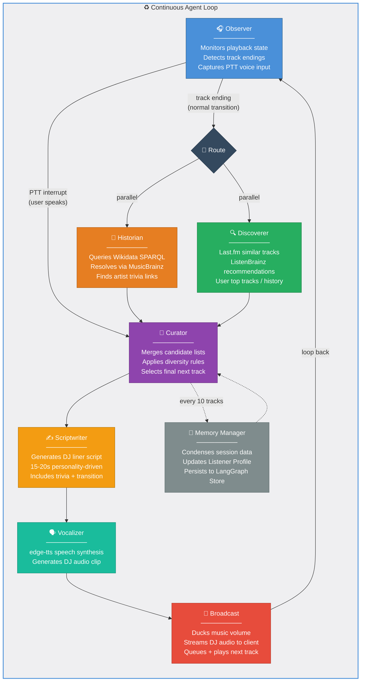

# 📻 EchoDJ

An agentic, personalized AI radio station built on the Spotify ecosystem.

EchoDJ replicates the lean-back experience of a traditional radio station by choosing songs based on your deep listening history and speaking between tracks like a real DJ. Unlike static playlists, EchoDJ is **agentic**: it reasons over knowledge graphs to find trivia links between songs, discovers new music through collaborative filtering, and responds to real-time voice commands.

## Architecture

```
Frontend (Next.js 16 / React 19)  ←──WebSocket──→  Backend (FastAPI + LangGraph)
        │                                                │
        ├── Spotify Web Playback SDK                     ├── Wikidata SPARQL (artist trivia)
        ├── Web Audio API (visualizer)                   ├── MusicBrainz REST (artist IDs)
        └── PTT audio capture (16kHz PCM)                ├── Last.fm API (similar music)
                                                         ├── ListenBrainz API (recommendations)
                                                         ├── Gemini Native Audio API (text-to-speech)
                                                         ├── Faster-Whisper (speech-to-text)
                                                         └── LLM (Gemini or Ollama)
```

### 7-Node Agent Loop

The core of EchoDJ is a **LangGraph** state machine with 7 specialized nodes that orchestrate the DJ experience:



### Execution Modes

**Normal Transition** — when a track is about to end:
```
Observer → [Historian ∥ Discoverer] → Curator → Scriptwriter → Vocalizer → Broadcast → Observer
```

**PTT Interrupt** — when the user speaks mid-song:
```
Observer → Curator (re-route based on voice command) → Scriptwriter → Vocalizer → Broadcast → Observer
```

**Memory Checkpoint** — every 10 tracks:
```
Curator → Memory Manager → Curator (enriched with long-term preferences)
```

### Node Details

| Node | Role | Data Sources |
|:-----|:-----|:-------------|
| **Observer** | Monitors Spotify playback state, captures PTT audio, detects track endings | Spotify SDK events, browser microphone |
| **Historian** | Finds trivia links between consecutive artists via knowledge graph | Wikidata SPARQL, MusicBrainz REST |
| **Discoverer** | Finds tracks the user will enjoy via collaborative filtering | Last.fm, ListenBrainz, Spotify user profile |
| **Curator** | Merges candidate lists, applies diversity rules, selects final track | Historian + Discoverer outputs, LangGraph Store |
| **Scriptwriter** | Generates a personality-driven spoken liner (15–20s) | Trivia link, track metadata, LLM |
| **Vocalizer** | Converts script to speech audio | edge-tts |
| **Broadcast** | Signals frontend to duck music, streams DJ audio, queues next track | WebSocket to frontend |
| **Memory Manager** | Condenses session data into persistent Listener Profile | LangGraph Store (SQLite) |

## Prerequisites

- **Spotify Premium** account (Web Playback SDK requires Premium)
- **Python 3.12+**
- **Node.js 18+**
- **NVIDIA GPU** with CUDA (for Faster-Whisper STT — or set `ECHODJ_WHISPER_DEVICE=cpu`)

## Setup

### 1. Clone & Configure

```bash
git clone https://github.com/your-username/DJv3.git
cd DJv3
```

### 2. Get API Keys

You'll need these API keys (see [docs/API_KEYS_SETUP.md](./docs/API_KEYS_SETUP.md) for detailed instructions):

| Key | Where to get it | Required? |
|-----|-----------------|-----------|
| **Spotify Client ID & Secret** | [developer.spotify.com/dashboard](https://developer.spotify.com/dashboard) | ✅ Yes |
| **Last.fm API Key** | [last.fm/api/account/create](https://www.last.fm/api/account/create) | ✅ Yes |
| **Gemini API Key** | [aistudio.google.com/apikey](https://aistudio.google.com/apikey) | ✅ Yes (or use Ollama) |
| **ListenBrainz Token** | [listenbrainz.org/settings](https://listenbrainz.org/settings/) | Optional |

> **Spotify Dashboard Setup:**
> 1. Create an app at [developer.spotify.com/dashboard](https://developer.spotify.com/dashboard)
> 2. Check both **"Web Playback SDK"** and **"Web API"**
> 3. Set the **Redirect URI** to `http://127.0.0.1:3000/callback`
>
> ⚠️ **Important (2025 Spotify API Changes):**
> - Spotify no longer allows `localhost` in redirect URIs — you **must** use the loopback IP `http://127.0.0.1:3000/callback`
> - Apps in **Development Mode** require all users to be manually added to the **User Management** allowlist in the dashboard (up to 25 users)
> - To add a user: Dashboard → Your App → **User Management** → enter their Spotify email → click **Add**
> - The Web Playback SDK requires a **Spotify Premium** account

### 3. Configure Environment

```bash
# Backend (.env)
cp .env.example .env
# Edit .env — fill in your Spotify, Last.fm, and Gemini keys

# Frontend (.env.local)
cp frontend/.env.local.example frontend/.env.local
# Edit frontend/.env.local — set NEXT_PUBLIC_SPOTIFY_CLIENT_ID
# (must match SPOTIFY_CLIENT_ID in backend .env)
```

### 4. Start Backend

```bash
cd backend
python -m venv .venv

# Activate virtual environment:
.venv\Scripts\activate     # Windows
# source .venv/bin/activate  # macOS/Linux

pip install -e ".[dev]"
pytest tests/ -v           # Verify 125 tests pass
uvicorn echodj.server:app --reload --port 8000
```

### 5. Start Frontend

```bash
cd frontend
npm install
npm run dev
```

### 6. Open & Connect

Navigate to **http://127.0.0.1:3000**, log in with your Spotify Premium account, and start listening. The DJ will take over between tracks.

> **Note:** You must access the app via `http://127.0.0.1:3000` (not `localhost`) to match the redirect URI registered with Spotify.

## Using Ollama (Local LLM)

To run without any API-based LLM:

1. Install [Ollama](https://ollama.com/)
2. Pull a model: `ollama pull gemma3:4b`
3. Start Ollama: `ollama serve`
4. Update `.env`:
   ```
   ECHODJ_LLM_PROVIDER=ollama
   ECHODJ_LLM_MODEL=gemma3:4b
   OLLAMA_BASE_URL=http://localhost:11434
   ```

## Running Without a GPU

If you don't have an NVIDIA GPU, set Whisper to use CPU in `.env`:

```
ECHODJ_WHISPER_DEVICE=cpu
ECHODJ_WHISPER_COMPUTE_TYPE=float32
ECHODJ_WHISPER_MODEL=base
```

> Note: CPU transcription will be significantly slower (~5-10x). You can also disable PTT entirely and rely on the automatic DJ transitions.

## Documentation

- [Product Specification](./ECHODJ_SPEC.md) — Full system spec (1,200 lines)
- [API Keys Setup](./docs/API_KEYS_SETUP.md) — How to get and configure all API keys
- [Spec Review Notes](./docs/SPEC_REVIEW_NOTES.md) — Architecture decisions and risk areas
- [Development Guide](./docs/DEVELOPMENT.md) — Dev workflow and testing

## Tech Stack

| Layer | Technology |
|-------|-----------|
| Frontend | Next.js 16, React 19, TypeScript |
| Playback | Spotify Web Playback SDK |
| Backend | FastAPI, LangGraph, Python 3.12+ |
| LLM | Gemini 2.0 Flash or Ollama (local) |
| STT | Faster-Whisper (local GPU) |
| TTS | Gemini 2.0 Native Audio / edge-tts (fallback) |
| Knowledge | Wikidata SPARQL, MusicBrainz REST |
| Discovery | Last.fm, ListenBrainz |
| Persistence | SQLite (LangGraph checkpointer + memory) |

## License

This project is a Master's in Data Science capstone. All rights reserved.
